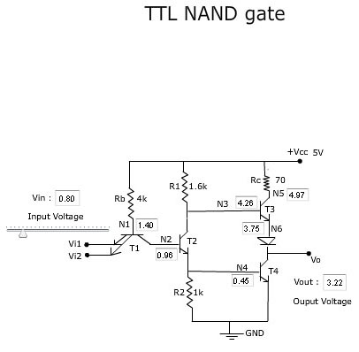
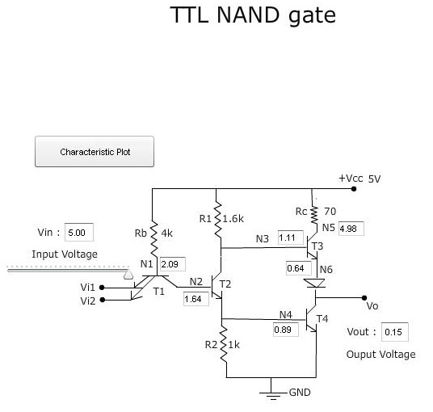
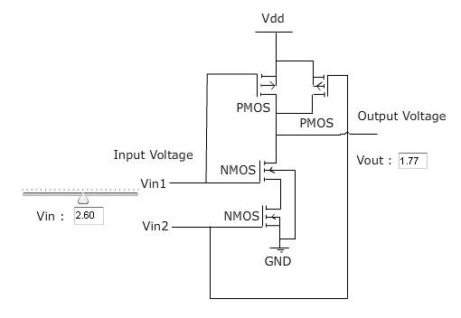
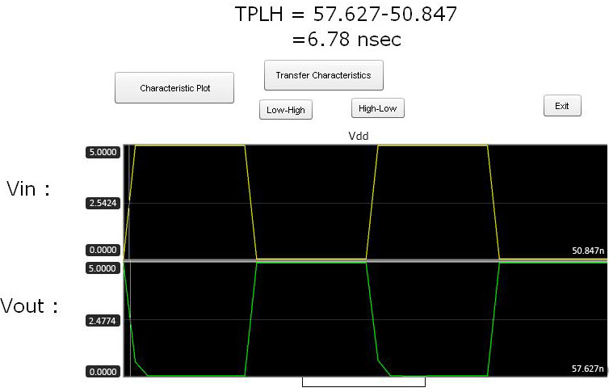
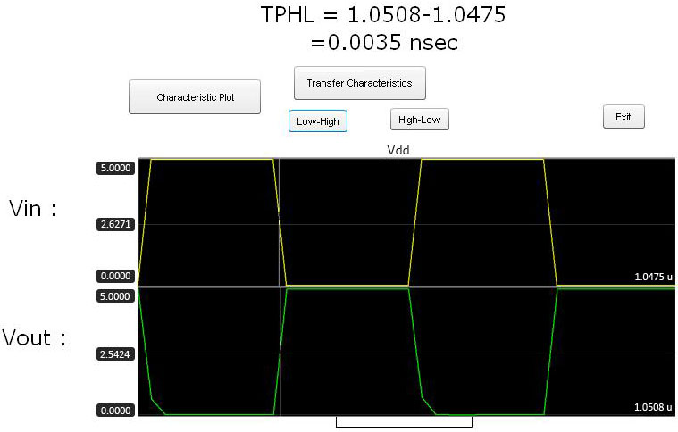
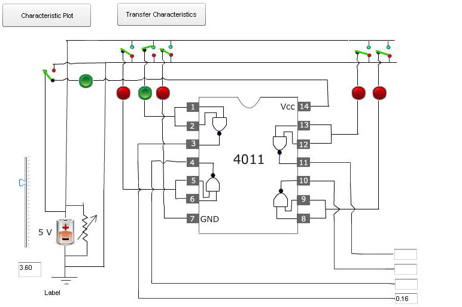
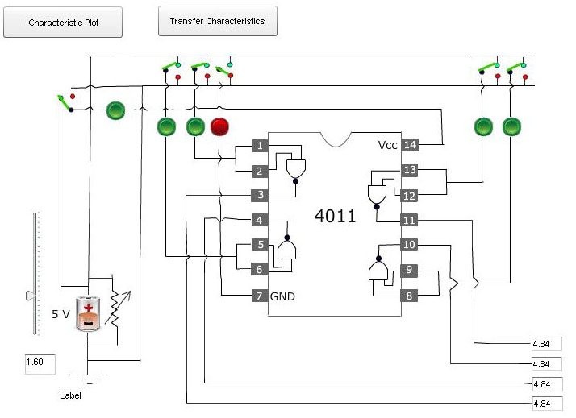

 

                            Procedure
                        

 
                            
                            

Please follow these steps to do the experiment.

                             
                             
                            

                            
Part 1: .TTL NAND gate circuit

                         
<ol>
                            
<li class="expt1">	At first change the input voltage. Then observe the corresponding voltage at each node and also obseve the output voltage </li>

				
				

                            	<li class="expt1">At the time of changing the input voltage, when input voltage reaches 5 voltage characteristic plot button will be appeared.</li>

				
				

                                <li class="expt1">Next,  Click on the characteristic plot.Characteristic plot will be appeared.</li>
                                <li class="expt1">Next,  Click on the exit button.</li>

				
				

                                </ol>
                                 
                                
                                
 
Part 2: TTL NAND gate using IC 7400

                                
<ol>
                                
<li class="expt1">	At first  connect VCC and GND properly. Apply high voltage to VCC and apply low voltage to GND.</li>
                                <li class="expt1">	Next,  apply high voltage to one of the NAND gate inputs among four.</li>
                                <li class="expt1">	Next, Change the input voltage level. Then observe the corresponding output voltage of that particular NAND gate.</li>  
				

				
				

                                <li class="expt1">If we apply high voltage to each NAND gate input we get coresponding output voltage of each NAND gate.</li>
				

				
				

                                <li class="expt1">Click on characteristic plot. Then corresponding plot will be appeared.
</li>
				

				
				

                                
                                
                               
                            
 </ol>
				
Part 3: CMOS NAND gate circuit

                                
 <ol>
                                
 <li class="expt1">When we change the input voltage the corresponding output voltage will be appeared.</li>
				

				
				

                                <li class="expt1">At the time of changing the input voltage, when it reaches 5 voltage characteristic plot and transfer-characteristic buttons will be appeared.</li>
				

				
				

                                <li class="expt1">Next,  Click on the characteristic plot.Characteristic plot will be appeared.</li>
				
 <li class="expt1">Next,  Click on the exit button.</li>
				

				
				

                                <li class="expt1">Next,  Click on the Transfer characteristic button. High to Low and Low to High options will be appeared.</li>
				

				
				

                                <li class="expt1">Next, click on the High to Low option.The plot will be appeared.</li>
				<li class="expt1">Next, click on the Low to High option.The plot will be appeared.</li>
                                

				
				
   
                                 
                                Fig: a) High to Low 

                                 
                                  
                            

				
				
 
                                 
                                Fig: b) Low to High

                                 
                                 
                                
    
                            </ol>

PPart 4: CMOS NAND gate using IC 4011

                                
 <ol>
                                
<li class="expt1">At first  connect VCC and GND properly. Apply high voltage to VCC and apply low voltage to GND.</li>
				
<li class="expt1">Next,  apply high voltage to one of the NAND gate inputs among four.</li>
				
 <li class="expt1">Change the input voltage level.Then observe the corresponding output voltage of that particular NAND gate.</li>
				

				
				

                                <li class="expt1">If we apply high voltage to each NAND gate input we get coresponding output voltage of each NAND gate.</li> 
				

				
				

                                <li class="expt1">Click on characteristic plot. Then corresponding plot will be appeared.</li>
				

				
				

                                <li class="expt1">After clicking Transfer characteristic button two options, such as High to Low and Low to High will be appeared.</li> 
				
<li class="expt1">Next click on High to Low and Low to High respectively.Corresponding plot will be appeared.
                             Then click on Exit button to go back to the experient.</li> 
                                

				
				
  
                                 
                                Fig: a) High to Low 

                                 
                                  
                            

				
				
 
                                 
                                Fig: b) Low to High

                                 
                                 
                                
 
                            </ol>

                            
                        

                    </section>