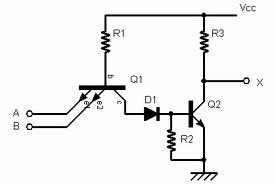
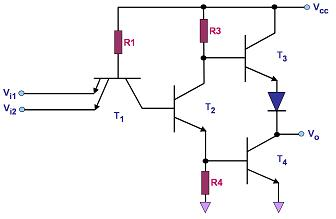
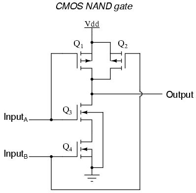

## Theory

                            
                            
<b>TTL NAND Gate:</b>

                             
                            

                            

		
  
  
Figure 1:&nbsp;Multiple Input Emitter Structure of TTL

                             
                             
                             In the above diagram if any input is low, the corresponding base-emitter junction becomes forward-biased and the transistor conducts.
 
                             
                                                 

<b>Logical Operation</b>
 
                            
                            A table of conduction states has been drawn up showing the state of each transistor in the circuit for all possible input conditions to verify the logic function performed. The direction of conduction of T1 can be in the forward or reverse mode so this should also be noted in the table. It can be seen from the table that the output goes LOW only when both inputs are HIGH which verifies the NAND function.

 Vi1| Vi2 | T1 | T2 | T3| T4 |D |Vo|
:--|:--|:--|:--|:--|:--|--|:--|
 Low|Low|ON(for)|OFF|OFF|ON|ON|HIGH|
 Low|HIGH|ON(for)|OFF|OFF|ON|ON|HIGH|
 HIGH|Low|ON(for)|OFF|OFF|ON|ON|HIGH|
 HIGH|HIGH|ON(for)|OFF|OFF|ON|ON|LOW|

				
				

                             
                             
Figure 2:&nbsp;Circuit Diagram of a Standard 2-input TTL NAND Gate

  
                               
                              
<b>CMOS NAND Gate:</b>

                               

				
				

                             
                              
 
Fig 3: &nbsp;Q1,Q2: PMOS &nbsp;&nbsp; Q3,Q4: NMOS

                             
                             
                            More complex logic functions such as those involving AND and OR gates require manipulating the paths between gates to represent the logic. When a path consists of two transistors in series, both transistors must have low resistance to the corresponding supply voltage, modeling an AND. When a path consists of two transistors in parallel, either one or both of the transistors must have low resistance to connect the supply voltage to the output, modeling an OR.
Shown on the right is a circuit diagram of a NAND gate in CMOS logic. If both of the A and B inputs are high, then both the NMOS transistors (bottom half of the diagram) will conduct, neither of the PMOS transistors (top half) will conduct, and a conductive path will be established between the output and Vss (ground), bringing the output low. If either of the A or B inputs is low, one of the NMOS transistors will not conduct, one of the PMOS transistors will, and a conductive path will be established between the output and Vdd (voltage source), bringing the output high.

 

                             
                           
 
